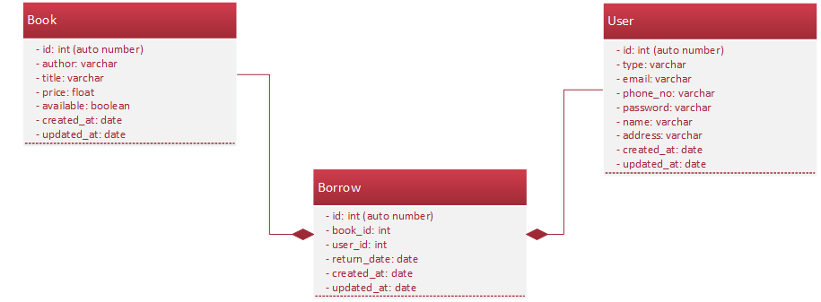

# Silex + Fractal + Eloquent ORM + Phinx

[](https://raw.githubusercontent.com/hyperium/hyper/master/LICENSE)

A simple JSON API implemented with Silex, Fractal & Eloquent
## Introduction
**Database Table**



Component used:

- [Silex micro-Framework](http://silex.sensiolabs.org/)
- [Eloquent ORM](https://github.com/illuminate/database)
- [Fractal](https://github.com/thephpleague/fractal)
- [Phinx Migration](https://github.com/robmorgan/phinx)
- [PHPDotEnv](https://github.com/vlucas/phpdotenv)
- [Twig Template](http://twig.sensiolabs.org/)
- [VarDumper](https://github.com/symfony/var-dumper) for dev only.
- [Faker](https://github.com/fzaninotto/Faker)
- [JWT](https://github.com/firebase/php-jwt/)

## Requirement
- Nginx or Apache
- PHP 5.6+
- [MySQL](https://www.mysql.com/)
- [Composer](https://getcomposer.org/)

*Optional for DevOps*
- [Vagrant](https://www.vagrantup.com/)
- [Docker](https://www.docker.com)

## Installation
**1.** Clone this repo
```bash
git clone https://github.com/rahman5147/Silex-w-Fractal-API.git
cd Silex-w-Fractal-API
```
or download this [source code directly](https://github.com/rahman5147/Silex-w-Fractal-API/archive/master.zip)

**2.** Install the Composer dependencies:
```bash
composer install
```

**3.** Create configuration file at project root fodler by making a copy of `.env.example` & name it to `.env`
```
cp .env.example .env
```
*Windows command prompt equivalent `copy .env.example .env`*

**4.** Update `.env` file value usually according to your database setup config:
- `DB_DATABASE`
- `DB_USERNAME`
- `DB_PASSWORD`

**5.** Create a database the same name as according to your `DB_DATABASE` value that you just set inside `.env`.

**6.** Setup the database using migration tool with `Phinx`
```bash
vendor/bin/phinx migrate
vendor/bin/phinx seed:run
```
*Note: To rollback/undo this setup issue the following command `vendor/bin/phinx rollback -t 0`*

## Configure for Vagrant machine
```
vagrant up
```
Open this url after [http://192.168.0.100](http://192.168.0.100)

## Configure for Docker
**1.** Fetch docker repository
```bash
git submodule update --init -- "docker"
```
**2.** Need to create `docker-compose.yml` file from `docker-compose.yml.example`
```
cd docker
cp docker-compose.yml.example docker-compose.yml
```
**3.** Configure `docker-compose.yml`:-
- In nginx > environment > NGINX_ROOT value set to public folder that contains `index.php`
- In mysql > environment > MYSQL_DATABASE value set to same as in file `.env` of `DB_DATABASE`
- In mysql > environment > MYSQL_PASSWORD value set to same as in file `.env` of `DB_PASSWORD`
```
vim docker-compose.yml
```
**4.** Start docker container/image
```
docker-compose up -d nginx phpmyadmin
```
**5.** To visit app: [192.168.99.100](http://192.168.99.100). For phpmyadmin [192.168.99.100:8080](http://192.168.99.100:8080?).

**6.** Stop docker & destroy container
```
docker-compose down
```

## Todo
Documentation